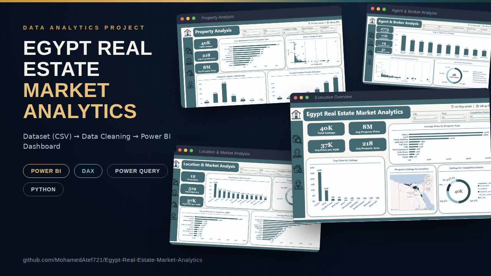

# Egypt Real Estate Market Analysis

## 📌 Project Overview

This project analyzes the Egyptian real estate market using property listing data to identify the key factors influencing property prices and market activity.

The project explores the relationships between **location, property characteristics, pricing, property types, agents, and brokers**. The goal is to transform raw real estate data into meaningful insights that help better understand the structure and behavior of the Egyptian real estate market.


---
## 🎯 Business Objective

The Egyptian real estate market contains a large amount of property listing data. However, raw data alone can make it difficult to identify meaningful patterns and understand what drives property prices.

This project aims to answer important business questions such as:

- Which locations have the highest property prices?
- Which cities have the highest number of property listings?
- How does property area affect property price?
- How do prices vary across different property types?
- How does the number of bedrooms relate to property prices?
- Which districts have the highest average price per square meter?
- Which agents have the highest market activity?
- Which brokers have the largest share of property listings?

---

## 🔍 Analysis Scope

### 1. Executive Overview
Provides a high-level view of the Egyptian real estate market using key performance indicators and overall market metrics.

### 2. Location & Market Analysis
Explores the relationship between property prices and geographic locations, including cities and districts.

### 3. Property Analysis
Analyzes how property characteristics such as area, property type, and number of bedrooms relate to property prices.

### 4. Agent & Broker Analysis
Examines market activity and performance across real estate agents and brokers.

---

## 🛠️ Tools & Technologies

- **Power BI** – Data visualization and dashboard development
- **Power Query** – Data cleaning and transformation
- **DAX** – Measures, KPIs, and calculations
- **Python (Pandas)** – Data cleaning and preparation
- **Git & GitHub** – Version control and project documentation

---

## 📊 Key Metrics

- Total Listings
- Average Property Price
- Average Property Area
- Average Price per SQM
- Total Cities
- Total Districts
- Total Agents
- Total Brokers
- Average Listings per Agent
- Average Listings per Broker

---

## 📈 Key Insights Explored

The project investigates:

- Price differences across Egyptian cities and districts
- Property distribution by location
- Price variation by property type
- The relationship between property area and price
- Listing distribution by number of bedrooms
- Average property price by number of bedrooms
- Top-performing real estate agents
- Broker market share

---

## 🧹 Data Preparation

The dataset was prepared before analysis by performing data cleaning and transformation tasks, including:

- Handling missing values
- Cleaning and standardizing text fields
- Reviewing property and location data
- Correcting inconsistent values
- Preparing the dataset for analysis in Power BI

---

## 📂 Project Structure

```text
Egypt-Real-Estate-Market-Analysis/
│
├── data/
│   └── Egypt Real Estate Data.csv
│   └── Egypt Real Estate Cleaning Data.csv
│
├── PowerBI Dashboard/
│   └── Egypt Real Estate Market Analysis.pbix
│
├── images/
│   ├── Executive Overview.png
│   ├── Location & Market Analysis.png
│   ├── Property Analysis.png
│   └── Agent & Broker Analysis.png
│
├── Notebooks/
│   └── Data Cleaning and Preparation.ipynb
│
├── README.md
└── LICENSE
```


---

## 🖥️ Dashboard Sections

The Power BI report is organized into four analytical sections:

1. **Executive Overview**
2. **Location & Market Analysis**
3. **Property Analysis**
4. **Agent & Broker Analysis**

Users can interact with the report and filter the analysis based on:

- City
- Year
- Completion Status
- Property Type
- Furnished Status

---

## 🚀 Project Goal

The main goal of this project is to demonstrate an **end-to-end data analytics workflow**, starting with data preparation and cleaning, followed by exploratory analysis, data modeling, DAX calculations, and interactive visualization in Power BI.

The final result provides a structured analytical view of the Egyptian real estate market and helps uncover the factors that influence property prices and market activity.

---

## ☕ Let's Connect

Let's stay in touch! Feel free to connect with me on the following platforms:

[](https://www.linkedin.com/in/mohamed-atef22/)
[](https://mohamedatef-ten.vercel.app/)


---
